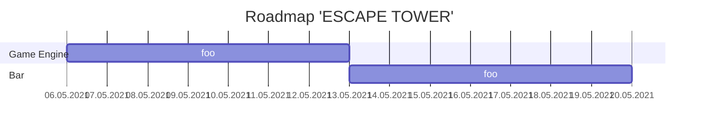

# Arbeitstitel: Escape Tower
(SoSe2021_Padi22)

Bei Escape Tower handelt es sich um ein RPG / Dungeon Game. Grundlage soll eine zweidimensionale Datenstruktur bilden, welche RAM-sparsam sehr große Maps zulässt, in denen sich der Spieler frei bewegen kann.

Das muss natürlich ausgenutzt werden! Da ich jedoch nicht das halbe Semester damit zubringen möchte, Maps in Textfiles zu tippen und es sicherlich eine andere Baustelle wäre, einen Mapeditor zu entwickeln, reizt mich das [**S**]-Kriterium der **prozedural generierten Map**. Obwohl ich es durchaus als Herausforderung ansehe, mich in die Algorithmik der dynamischen Maperstellung einzuarbeiten, halte ich es (im Hinblick auf eine gute Note :wink:) für in der mir zur Verfügung stehenden Zeit schaffbar, ein *Dungeon-Game* zu bauen, welches seine Etagen beim Betreten frisch berechnet. Das ermöglicht natürlich **beliebig viele Level** und **diverse Schwierigkeitsgrade**.

Ziel des Spielers ist es, auf jeder Etage des Dungeons das Ziel (Treppe oder Ausgang) zu erreichen um auf die nächste Etage zu gelangen, bis er irgendwann alle Etagen absolviert und damit seine Freiheit erspielt hat.

Dabei stehen dem Spieler in dem Labyrinth aus Räumen einer Etage natürlich diverse Hindernisse im Weg. Vorstellbar wären:
- Gegner, die den Spieler töten (oder nur verletzen? :thinking:) können
- Verschlossene Türen, für die erst ein Schlüssel gefunden werden muss
- Darkrooms, für die ein Licht-Item hilfreich (aber nicht erforderlich) ist
- ... sowie andere Quests / Hindernisse

Ein Speichern und Laden des Spielstands soll möglich sein, aber evtl. nicht zu jedem Zeitpunkt. Vielleicht nur beim betreten einer Etage oder durch ausnutzen eines speziellen Speicher-Items.

---

## Bewertungskriterien
... aus der [PADI-Tabelle](https://graphics.tu-bs.de/teaching/ss21/padi)
### Pflichtkriterien
Diese Kriterien möchte ich auf jeden Fall umsetzen, damit nach o.g. Konzept ein gutes Game entsteht.
- prozedural generierte Map [S]
  - bzw. auch: Levelgeneration im Spiel [A] 
  - **Wo ist da der Unterschied?**
- Quest / Inventar - Management [A]
- 3+ (beliebig viele) Level [C]
- Schwierigkeitsgrade [C]
- Speichern/Laden [C]

### Wenn es die Zeit zulässt
Diese Kriterien wären allgemein wünschenswert und werden daher umgesetzt, sollte es die Zeit am Ende noch zulassen.
- Einfache Animationen [B]
- Controllerunterstützung [B]
- Betriebssystemunabhängigkeit [B]
- Sound [C]

## Roadmap

- Game Engine
  - Keyboard Events umsetzen, Rendering von Events trennen (-> flüssiges Gameplay)
  - Window Resize Event führt zu Game Resize
  - Game Engine testen + bugfixes
    - test Datenstruktur mit vielen Entities + Mal in den RAM schauen
- Wizard (Map)
  - Einarbeitung und Konzeptentwicklung [Procedural Content Generation Wiki](http://pcg.wikidot.com/category-pcg-algorithms)
    - Maze-Algorithmus finden
    - implementieren / abändern
    - (ggf. Maze zu Maze aus Räumen aufpumpen - je nach Zeit+Möglichkeit)
  - Wizard für Struktur der Etage (Maze)
  - Wizard für Inhalt der Räume, Enemies, Items (nach Erstellung der Klassen natürlich)
- Items
  - Itemklasse bauen (Erbt von MapObject)
  - Item Bag rendering
  - Item use trigger (keyboard)
  - Item use animation
  - Item Stock befüllen
- Quests
  - Questklasse bauen
  - Quest Stock befüllen
- Save & Load
- Enemies
  - Enemyklasse bauen (Erbt von MapObject)
  - Konzept des Angriffs wenn Angriffsradius betreten
  - (evtl. Bewegung im Bewegungsradius)
  - Enemy Stock befüllen

## Konzeptionelles
### MapObject und Vererbung?
Tote Objekte $\in$ MapObject
Noch in MapObject implementieren:
- Textures für beide Y Richtungen hinzufügen (also sodass 3 Tex. insgesamt existieren)
Macht Vererbung Sinn?:
- LivingObject $\in$ MapObject hätte zusätzlich:
  - Bewegungsanimationen (Gif-Textures? (3 St.))
  - Sterbeanimation (Gif-Textures? (3 St.))
- Enemy $\in$ LivingObject hätte zusätzlich:
  - Bewegungsradius
  - Angriffsradius
  - Angriffsanimation (Gif-Textures? (3 St.))
- Item $\in$ MapObject hätte zusätzlich:
  - Benutzanimation (Gif-Textures? (3 St.))
  - Benutzradius
  - Farben (Kann SFML Sprites einfärben?)

### Umsetzung "Dinge tun"
Wie schließe ich eine Tür auf? Wie bekämpfe ich einen Enemy?

Idee: Quest-Klasse, die definiert, welches Item, welchen Gegner töten kann etc.:
- Also Flammenwerfer tötet z.B. Pflanzenmonster, aber nicht Steinmonster.
- Grüner Schlüssel öffnet grüne Tür, aber nicht blaue.

#### Quest-Klasse
Vars: 
- MapObject1 -> Item
- MapObject2 -> can be used with (optional - if empty: can used everywhere)
- aktion     -> Call a function

Funcs:
Pro Aktion eine Func.
- kill
- open
- save game
- teleport
- ...

### Stock
Datenstruktur für vordefinierte Objectinstanzen. Einfacher Key-Value Store. Wahrscheinlich einfach konstantes Array oder so?
Natürlich ginge stattdessen auch krasse Durchvererbung bis Texturen und co hardgecoded in Tochterklassen vorliegen.

### Wizard (wahrschenlich zu zeitaufwändig)
#### Step 1: Räume
Idee:
~~Male Raumgrenzen von Etagenende zu Etagenende (wie Stift über Papier) sodass min. Rauminhalt und Kantenlängen nicht unterschritten werden. Tue dies so lange, bis maximale Raumgrößen und Kantenlängen nicht mehr überschritten werden.~~
--> zu kompliziert.

Idee2:
1. Wähle Raumform $\in$ {Rechteck, Quadrat, ...}
2. Wähle Raumgrößen $x, y \in \{a | a_{min} ≤ a ≤ a_{max}\}$
3. Platziere Raum auf $x_0, y_0$
4. Wiederhole 1-3 für $x_0+x, y_0$ bis genug Spalten
5. Wiederhole 1-4 für jede Zeile bis genug Zeilen
Genug heißt hier: Bis verbleibender Platz auf der Etage $≤ a_{max}$
*Vorteil:* Ich kann jeden Raum aufzählen, kenne die Position und kann Distanzen zwischen Räumen berechnen

#### Step 2: Maze
Verbinde Räume durch Durchbrüche miteinander.

Idee: Maze Algorithmus?

Andere Idee: Random? - je weiter innen der Raum, desto mehr durchbrüche. (Könnte möglicherweise in die Hose gehen)

#### Step 3: Place
- Versperre manche Durchgänge durch Türen etc.
- Platziere Items in manchen Räumen
- Platziere Gegner in manchen Räumen

### Wizard alternativ:
jede Etage ist ein Maze - **es gibt keine Räume**. Das hat auf das Spielkonzept keinen Einfluss. Ich denke, das probiere ich zuerst - falls dann noch Zeit sein sollte, werden aus dem Maze Räume "gepumpt".
Maze sollte aber eine Gangbeite von min. 2 (besser 3) Positionen haben.