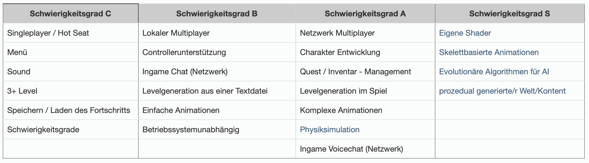

# ESCAPE Game
Dies ist ein Projekt aus meinem Studium, in dem es darum ging, ein Semester lang eigenständig ein 2D-Game mithilfe der C++ Library SFML zu erstellen.

Dafür mussten im Rahmen eines [Proposals](proposal.md) Features ausgewählt werden, aus denen mitunter die Bewertung resultierte:

Zum Abschluss sollte noch ein Teaservideo für das Game erstellt werden:

./'ESCAPE Teaser.mp4'
